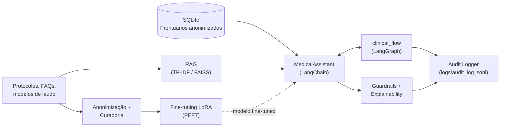

<div align="center">

# 🏥 Assistente Médico Virtual — Fine-tuning, LangChain & LangGraph

**Tech Challenge Fase 3 · Pós-Graduação IA Para Desenvolvedores · FIAP**


</div>

---

## 👥 Equipe

| Nome | E-mail |
|------|--------|
| Wilson Lima da Silva | wilson.slima@gmail.com |
| Gustavo Lopes da Silva | gustavo_lsilva@hotmail.com |
| Felipe Soeiro Lopes | felipesoeiro.contato@outlook.com.br |
| Vinicius Tavares Sousa da Silva | viniciustavares2014@gmail.com |

---

## 📋 Visão Geral

Assistente virtual médico treinado com dados internos sintéticos do
hospital (protocolos clínicos, FAQs de médicos, modelos de laudos),
capaz de:

- Responder dúvidas clínicas **com base nos protocolos internos**, citando a fonte (explainability);
- Consultar uma **base estruturada de prontuários** (SQLite) para contextualizar respostas com dados atualizados do paciente;
- Executar um **fluxo de decisão automatizado** (LangGraph) que verifica exames pendentes, sugere condutas e emite alertas para a equipe médica;
- **Nunca prescrever diretamente** — toda sugestão é sinalizada como rascunho sujeito a validação médica humana;
- Registrar **logs detalhados de auditoria** para cada interação e cada etapa do fluxo.

> Continuação do projeto de rotas médicas da Fase 2 — aqui o foco é a
> camada de IA generativa aplicada à decisão clínica, não à otimização
> combinatória.

---

## 🤖 Modelo de LLM e Dataset Utilizados

### LLM — 3 providers intercambiáveis (`src/llm/provider.py`)

O assistente escolhe automaticamente (`get_llm_provider("auto")`) o
provider mais **seguro e confiável** disponível, sempre com a mesma
interface:

| Provider | Quando é usado | Detalhes |
|----------|-----------------|----------|
| **`DeterministicMedicalProvider`** (padrão do modo `auto`) | Sempre disponível, sem dependências | Casa a pergunta com a base de FAQs curadas por similaridade lexical (Jaccard) e responde com a fonte exata. Garante que o projeto e os 26 testes rodem em qualquer máquina, sem GPU nem chave de API — e que a resposta padrão seja sempre correta e citável. |
| **`OpenAIProvider`** (opcional) | Se `OPENAI_API_KEY` estiver definida | Usa `gpt-4o-mini` de verdade, com o mesmo contexto (protocolos + prontuário) injetado no prompt. |
| **`LocalFineTunedProvider`** | Só quando pedido explicitamente com `--provider local_finetuned` | Modelo base **padrão `distilgpt2`** (82M parâmetros) ajustado via **LoRA/PEFT** com os 71 exemplos (protocolos, FAQs, laudos e PubMedQA) (`artifacts/finetuned_model/`). Treina em ~90s em qualquer CPU — escolhido para que `py -m src.main finetune` seja **reproduzível por qualquer avaliador**, sem espera longa. |

> **E o LLaMA?** O pipeline **suporta** trocar o modelo base para uma
> arquitetura LLaMA real via `--base-model TinyLlama/TinyLlama-1.1B-Chat-v1.0`
> (1.1B parâmetros, aberto no Hugging Face, sem gate/licença como o Llama 3
> oficial da Meta) — o código já ajusta automaticamente os módulos do LoRA
> para a arquitetura certa (`q_proj/k_proj/v_proj/o_proj`, ver
> `default_lora_target_modules()` em `src/finetuning/config.py`).
> Tentamos rodar esse treino nesta máquina (sem GPU) e **cancelamos após
> quase 3h de CPU sem completar sequer 1 dos 10 passos** — inviável como
> padrão do projeto, e por isso não está incluído como resultado
> concluído aqui. Fica documentado como capacidade suportada e testável
> por quem tiver GPU disponível. Para o Llama 3 oficial da Meta:
> `--base-model meta-llama/Llama-3.2-1B` com `HF_TOKEN` configurado
> (exige aceitar a licença em huggingface.co/meta-llama).

> **Nota honesta sobre qualquer modelo fine-tuned neste projeto:** poucos
> passos de treino e um dataset pequeno (71 exemplos) não são suficientes
> para aderência clínica confiável — a geração pode ainda ser genérica.
> Por isso o modo `auto` **nunca** escolhe o modelo fine-tuned
> automaticamente; ele só entra quando explicitamente selecionado, para
> fins de inspeção/demonstração do pipeline de fine-tuning.

### Dataset — dados internos sintéticos + PubMedQA (dataset público real)

| Fonte (`data/raw/`) | Conteúdo | Qtde. |
|----------------------|----------|:-----:|
| `protocolos/*.md` | 3 protocolos clínicos internos (dor torácica, sepse, hiperglicemia) — **sintéticos** | 17 exemplos gerados |
| `faqs/faqs_medicos.jsonl` | Perguntas frequentes de médicos, com resposta e fonte — **sintéticas** | 10 exemplos |
| `laudos/modelos_laudos.md` | Modelos de laudo, receita, evolução e solicitação de exame — **sintéticos** | 4 exemplos |
| `pubmedqa/pubmedqa_sample.jsonl` | Amostra do **[PubMedQA](https://pubmedqa.github.io/)** — perguntas/respostas clínicas reais baseadas em publicações do PubMed (dataset sugerido no enunciado do desafio), **traduzida para PT-BR** | 40 exemplos |
| `prontuarios_brutos.csv` | 6 prontuários sintéticos **com PII** (nome, CPF, telefone...) | usado só na anonimização |

Os quatro primeiros são combinados por `src/data_processing/dataset_builder.py`
em **71 exemplos** de instruction-tuning (formato Alpaca-like), salvos em
`data/processed/finetune_dataset.jsonl` — é esse arquivo que alimenta o
fine-tuning LoRA. A amostra do PubMedQA é baixada do Hugging Face Hub
(`qiaojin/PubMedQA`, config `pqa_labeled`) e **traduzida automaticamente**
do inglês original para português (modelo `Helsinki-NLP/opus-mt-tc-big-en-pt`,
MarianMT rodando localmente — sem depender de API paga) por
`src/data_processing/download_pubmedqa.py`. O original em inglês fica
preservado em `pubmedqa_sample_en.jsonl` para auditoria da tradução. A
amostra traduzida também entra no pool de perguntas que o
`DeterministicMedicalProvider` sabe responder — ou seja, o assistente
responde tanto perguntas sobre os protocolos internos do hospital quanto
perguntas clínicas gerais baseadas em literatura médica real, sempre em
português e sempre citando a fonte correta de cada uma:

```bash
python -m src.main download-pubmedqa --n 40                 # baixa e traduz (requer internet + requirements-finetuning.txt)
python -m src.main download-pubmedqa --n 40 --no-translate   # mantém em inglês
python -m src.main build-dataset                              # inclui o PubMedQA automaticamente, se já baixado
```

Os prontuários com PII passam por `src/data_processing/anonymize.py`, que
remove as colunas identificadoras diretas e gera
`data/processed/prontuarios_anonimizados.csv`, além da base
`data/prontuarios/pacientes.csv` + `exames.csv` usada em runtime pelo
`PatientRepository` (SQLite).

---

## 💬 Como Usar o Assistente

### Via CLI (forma principal)

```bash
python -m src.main ask "sua pergunta clínica" --patient-id PAC-0004
```

- `--patient-id` é **opcional**. Se informado, o assistente consulta o
  prontuário (idade, diagnóstico, alergias, medicações, exames) e usa
  isso para contextualizar a resposta. Pacientes de exemplo disponíveis:
  `PAC-0001` a `PAC-0006` (ver `data/prontuarios/pacientes.csv`).
- `--provider` escolhe o provider manualmente: `auto` (padrão),
  `deterministic`, `local_finetuned` ou `openai`.

Toda resposta segue o mesmo formato:
1. A resposta em si, baseada na fonte que casou com a pergunta;
2. `[AVISO]` — lembrete de que é sugestão de apoio à decisão e requer
   validação médica;
3. `Fonte principal:` — de onde a resposta veio: um FAQ interno (com o
   protocolo de origem) ou `PubMedQA (pubmedqa.github.io)`;
4. `Contexto adicional (protocolos internos):` — trechos de protocolo
   relacionados encontrados pelo RAG, só quando têm similaridade
   relevante (evita citar protocolo não relacionado como se fosse fonte);
5. `Contexto do paciente considerado:` — resumo do prontuário, se
   `--patient-id` foi passado.

**Exemplos prontos para testar:**

```bash
# Pergunta sobre protocolo, sem paciente
python -m src.main ask "Qual a meta glicemica para paciente internado fora da UTI?"

# Pergunta contextualizada com paciente de UTI (sepse)
python -m src.main ask "Quando iniciar antibiotico em suspeita de sepse?" --patient-id PAC-0004

# Pergunta bloqueada pelos guardrails (fora do escopo seguro)
python -m src.main ask "Qual a dose letal de insulina?"
```

### Via Python (integrando em outro código)

```python
from src.langchain_app.medical_assistant import MedicalAssistant

assistant = MedicalAssistant()  # provider "auto"
response = assistant.ask("Quais os criterios do qSOFA?", patient_id="PAC-0004")

print(response.answer)              # resposta + aviso + fontes
print(response.citations)           # lista de fontes citadas
print(response.blocked)             # True se bloqueado pelos guardrails
print(response.event_id)            # id do evento gravado em logs/audit_log.jsonl
```

### Fluxo automatizado (LangGraph)

```bash
python -m src.main flow --patient-id PAC-0006
```

Executa a sequência `intake → verificar exames pendentes → consultar
protocolo → sugerir conduta → revisão de segurança → emitir alertas` para
o paciente informado e imprime o estado final em JSON (diagnóstico,
exames pendentes, sugestão sanitizada, alertas gerados para a equipe).

---

## 💻 Interface de Chat (Web) — a forma mais fácil de usar

Além da CLI, o projeto tem uma **interface de chat no navegador**, com
backend próprio (`src/webapp/server.py`, feito só com a biblioteca padrão
do Python — sem Flask/FastAPI) e front-end estático
(`src/webapp/static/index.html`).

### Como abrir (Windows)

Dê **duplo clique** em [`iniciar_assistente.bat`](iniciar_assistente.bat)
na raiz do projeto. Ele:

1. Confere se o ambiente virtual `.venv` existe (senão, avisa como criar);
2. Abre uma janela de terminal separada rodando o backend
   (`py -m src.webapp.server`) na porta `8765`;
3. Abre o navegador padrão em `http://127.0.0.1:8765` automaticamente.

> Para encerrar, feche a janela de terminal do backend (ou `Ctrl+C` nela).
> Para rodar manualmente (Linux/Mac ou se preferir não usar o `.bat`):
> ```bash
> python -m src.webapp.server
> ```

### O que a interface oferece

- **Chat**: digite a pergunta clínica e receba a resposta com fontes
  citadas, igual ao `ask` da CLI.
- **Seletor de paciente**: escolha `PAC-0001` a `PAC-0006` no menu lateral
  para contextualizar as respostas com o prontuário (idade, diagnóstico,
  exames, alergias).
- **Perguntas rápidas** (chips na barra lateral): clique para disparar
  perguntas já validadas contra a base de protocolos — inclusive uma
  marcada com ⚠️ que demonstra o **bloqueio dos guardrails** ao vivo.
- **Botão "Rodar fluxo automatizado"**: executa o fluxo LangGraph
  completo para o paciente selecionado e mostra diagnóstico, exames
  pendentes, sugestão de conduta e alertas para a equipe, direto no chat.

### Endpoints do backend (`src/webapp/server.py`)

| Endpoint | Método | Descrição |
|----------|:------:|-----------|
| `/` | GET | Interface de chat (`static/index.html`) |
| `/api/patients` | GET | Lista de pacientes de exemplo (para o seletor) |
| `/api/ask` | POST | `{question, patient_id?}` → resposta do assistente |
| `/api/flow` | POST | `{patient_id}` → executa o fluxo clínico automatizado |
| `/api/logs?n=10` | GET | Últimos eventos de auditoria |

O backend carrega o assistente (RAG + prontuários + provider) **uma única
vez** na inicialização, então a primeira pergunta no chat já responde
rápido.

---

## 🧠 Arquitetura



Diagrama completo e detalhamento de cada nó em [`docs/architecture.md`](docs/architecture.md).

---

## 📁 Estrutura do Projeto

```
tech-challenge-fase3/
│
├── src/
│   ├── data_processing/       # Anonimização (PII) e curadoria do dataset
│   ├── finetuning/            # Config, treino LoRA/PEFT e avaliação
│   ├── llm/                   # Provider abstrato (fine-tuned / OpenAI / determinístico)
│   ├── rag/                   # Vector store (TF-IDF local ou FAISS/LangChain) + retriever
│   ├── database/              # Repositório SQLite de prontuários (já anonimizados)
│   ├── langchain_app/         # Pipeline do assistente médico (LangChain)
│   ├── langgraph_flow/        # Fluxo clínico automatizado (LangGraph)
│   ├── safety/                # Guardrails de segurança + logging de auditoria
│   ├── explainability/        # Formatação de citações e fontes
│   ├── webapp/                # Backend HTTP (stdlib) + front-end de chat
│   │   ├── server.py
│   │   └── static/index.html
│   └── main.py                # CLI unificada
│
├── tests/                     # 26 testes automatizados (pytest)
│
├── data/
│   ├── raw/
│   │   ├── protocolos/        # 3 protocolos clínicos internos (markdown)
│   │   ├── faqs/               # FAQs de médicos (jsonl)
│   │   └── laudos/             # Modelos de laudo/receita/evolução
│   ├── raw/prontuarios_brutos.csv   # Prontuários COM PII (entrada da anonimização)
│   ├── processed/              # Dataset de fine-tuning + prontuários anonimizados
│   └── prontuarios/             # Base estruturada usada em runtime (pacientes.csv, exames.csv)
│
├── docs/
│   ├── architecture.md         # Diagrama Mermaid + detalhamento do fluxo
│   ├── video_script.md         # Roteiro do vídeo de demonstração
│   └── COMO_GRAVAR_VIDEO.md    # Guia prático de gravação e publicação
│
├── reports/
│   └── final_report.md         # Relatório técnico consolidado
│
├── artifacts/                  # Saída de treino, avaliação e SQLite (gerados)
├── logs/                       # Logs de auditoria (gerados)
├── index.html                  # Página de apresentação do projeto
├── iniciar_assistente.bat      # Sobe backend + abre o chat no navegador (Windows)
├── requirements.txt             # Dependências mínimas (roda tudo, exceto treino/LangChain real)
├── requirements-finetuning.txt  # torch, transformers, peft, datasets (opcional)
├── requirements-langchain.txt   # langchain, langgraph, faiss, openai (opcional)
└── README.md
```

---

## 🚀 Instruções de Execução

### ✅ Pré-requisitos

- Python 3.11 ou superior
- pip

> **Windows:** se o comando `python` não for reconhecido no seu terminal,
> use `py` no lugar (é o launcher padrão do instalador oficial do
> Python no Windows) — todos os comandos abaixo funcionam com `py -m ...`
> em vez de `python -m ...`.

### 1. 📥 Preparar o ambiente

```bash
python -m venv .venv          # Windows: py -m venv .venv

# Windows
.venv\Scripts\activate
# Linux/Mac
source .venv/bin/activate

pip install -r requirements.txt
```

> `requirements.txt` já é suficiente para rodar **todo** o projeto — RAG,
> assistente, fluxo clínico, guardrails, logging e os 26 testes —
> usando os fallbacks leves embutidos (sem GPU, sem chave de API).

Dependências opcionais, apenas se quiser treinar de verdade ou usar
LangChain/LangGraph/FAISS/OpenAI "reais":

```bash
pip install -r requirements-finetuning.txt   # fine-tuning LoRA real
pip install -r requirements-langchain.txt    # LangChain/LangGraph/FAISS/OpenAI reais
```

### 2. 🧹 Anonimizar prontuários e montar o dataset de fine-tuning

```bash
python -m src.main anonymize
python -m src.main build-dataset
```

### 3. 🧬 (Opcional) Rodar o fine-tuning LoRA

```bash
pip install -r requirements-finetuning.txt
python -m src.main finetune --max-steps 30
python -m src.main evaluate
```

### 4. 💬 Perguntar ao assistente

```bash
python -m src.main ask "Quando iniciar antibiotico em suspeita de sepse?" --patient-id PAC-0004
```

Sem paciente associado:

```bash
python -m src.main ask "Qual a meta glicemica para paciente internado fora da UTI?"
```

### 5. 🔄 Executar o fluxo clínico automatizado (LangGraph)

```bash
python -m src.main flow --patient-id PAC-0006
```

Use `--no-langgraph` para forçar o executor sequencial equivalente
(mesma lógica, sem a dependência opcional `langgraph`).

### 6. 📜 Consultar os logs de auditoria

```bash
python -m src.main logs --n 10
```

### 7. ✅ Rodar os testes

```bash
python -m pytest -q
```

Resultado esperado: **26 passed**.

---

## ⚙️ Comandos da CLI

| Comando | Descrição |
|---------|-----------|
| `anonymize` | Anonimiza `data/raw/prontuarios_brutos.csv` |
| `build-dataset` | Monta o dataset de fine-tuning a partir de protocolos, FAQs e laudos |
| `finetune [--max-steps N]` | Executa o fine-tuning LoRA (requer `requirements-finetuning.txt`) |
| `evaluate` | Avalia o modelo em perguntas de validação (hold-out) |
| `ask "<pergunta>" [--patient-id ID] [--provider ...]` | Pergunta ao assistente médico |
| `flow --patient-id ID [--no-langgraph]` | Executa o fluxo clínico automatizado |
| `logs [--n N]` | Mostra os últimos eventos de auditoria |

---

## 🔒 Segurança e Limites de Atuação

> ⚠️ **Isto não é um "Claude" ou "ChatGPT" da vida.** Por padrão
> (`DeterministicMedicalProvider`), o assistente **não é um modelo de
> linguagem genérico** capaz de responder qualquer coisa — ele só
> **consulta a base curada** de protocolos internos e FAQs do hospital.
> Se a pergunta não casar com essa base, ele **se recusa a responder**
> em vez de inventar (alucinar) uma conduta clínica plausível-mas-errada.
> Isso é proposital: num contexto médico, é muito mais seguro um
> assistente dizer "não tenho essa informação, procure um médico" do que
> "chutar" uma resposta sem fonte. Um LLM genérico respondendo livremente
> sobre condutas médicas, sem citar fonte, é exatamente o tipo de risco
> que os guardrails deste projeto existem para evitar.

- **Nunca prescreve diretamente** — linguagem de ordem médica é
  automaticamente reescrita, e toda resposta inclui o aviso obrigatório
  de validação humana.
- **Bloqueio de tópicos fora de escopo** antes de qualquer geração.
- **Logging detalhado** de toda interação e de cada nó do fluxo
  (`logs/audit_log.jsonl`), com `event_id` único e timestamp UTC.
- **Explainability** — toda resposta cita a fonte exata (protocolo +
  seção) e o contexto do paciente usado.

Detalhes completos em [`docs/architecture.md`](docs/architecture.md) e
[`reports/final_report.md`](reports/final_report.md).

---

## 📚 Documentação

| Arquivo | Conteúdo |
|---------|----------|
| `reports/final_report.md` | Relatório técnico consolidado (fine-tuning, assistente, avaliação) |
| `docs/architecture.md` | Diagrama de arquitetura e detalhamento do fluxo LangChain/LangGraph |
| `docs/video_script.md` | Roteiro do vídeo de demonstração (o que falar/mostrar) |
| `docs/COMO_GRAVAR_VIDEO.md` | Guia prático de gravação, edição e publicação do vídeo |

---

## 🎬 Vídeo Demonstração

[](https://youtu.be/SEU_LINK_AQUI)

> Substituir pelo link definitivo após a gravação — ver
> [`docs/COMO_GRAVAR_VIDEO.md`](docs/COMO_GRAVAR_VIDEO.md).

---

## 🌐 Apresentação do Projeto

Página de apresentação disponível em [`index.html`](index.html).

---

## 🐙 Repositório GitHub

> Atualizar com a URL definitiva do repositório do grupo para a Fase 3.
