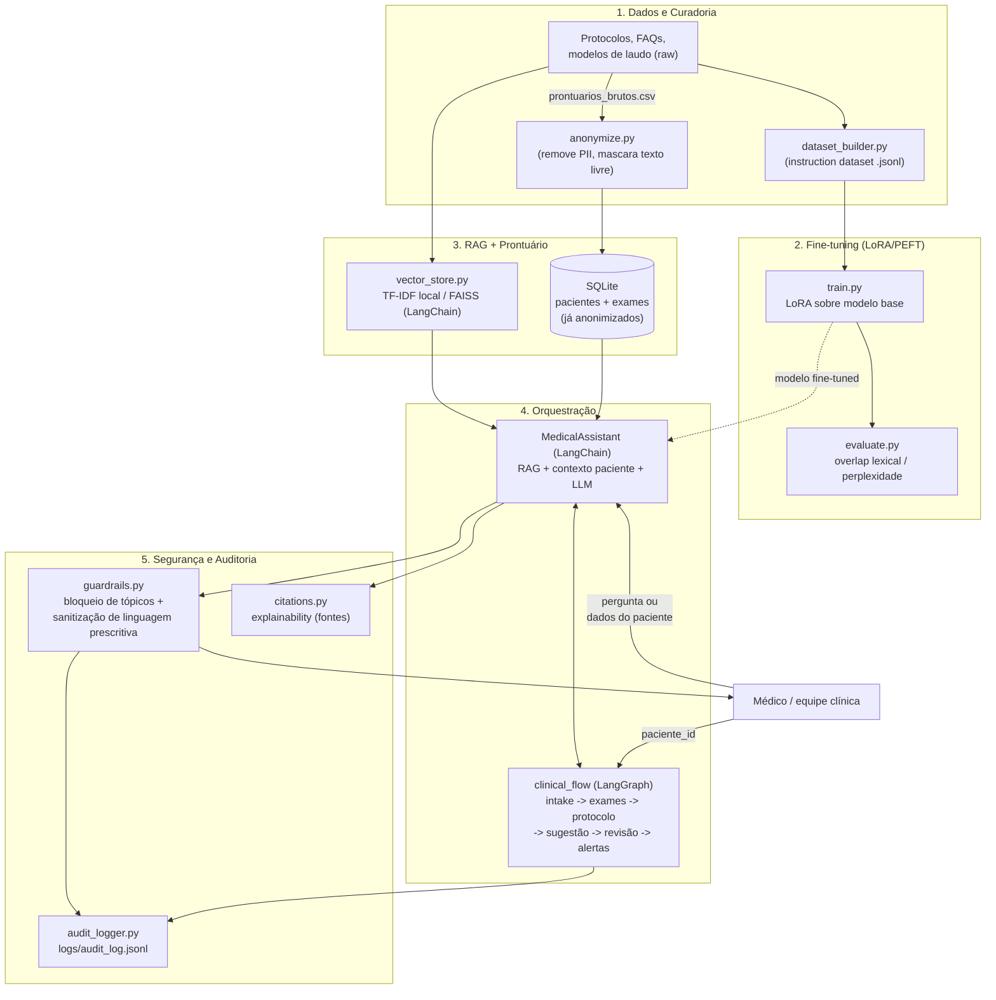

# Arquitetura — Assistente Médico Virtual

## Visão Geral

O sistema é composto por cinco camadas independentes e testáveis
isoladamente: **dados/curadoria**, **fine-tuning**, **RAG + prontuário**,
**orquestração (LangChain + LangGraph)** e **segurança/auditoria**.

## Fluxo LangGraph — Detalhamento dos Nós

| Nó | Responsabilidade | Saída |
|----|-------------------|-------|
| `intake` | Recebe o `paciente_id` e busca o registro no prontuário | `patient_found`, `diagnosis` |
| `verificar_exames_pendentes` | Consulta a tabela `exames` no SQLite | `pending_exams` |
| `consultar_protocolo` | Recupera trechos relevantes dos protocolos (RAG) para o diagnóstico | `protocol_guidance` |
| `sugerir_conduta` | Gera sugestão de próximos passos via LLM (nunca prescrição final) | `suggestion` (rascunho) |
| `revisao_seguranca` | Aplica guardrails — remove linguagem prescritiva direta, adiciona aviso obrigatório | `guardrail_flags`, `suggestion` sanitizada |
| `emitir_alertas` | Gera alertas para a equipe médica (diagnóstico de alto risco, exames pendentes) | `alerts` |

Todos os nós registram um evento em `logs/audit_log.jsonl` via
`AuditLogger.log_flow_event`, garantindo rastreabilidade completa do
fluxo automatizado.

## Por que dois modos de execução (LangChain/LangGraph "reais" vs. fallback)?

O projeto foi desenhado para ser **avaliável em qualquer máquina**, sem
exigir GPU, chave de API ou instalação de dependências pesadas:

- **Padrão (sempre funciona):** `TfidfVectorStore` (RAG local em memória) +
  executor sequencial equivalente ao grafo do LangGraph +
  `DeterministicMedicalProvider` (respostas baseadas nas FAQs curadas).
- **Modo avançado (opcional):** ao instalar `requirements-langchain.txt` e
  `requirements-finetuning.txt`, o mesmo código passa a usar
  `langgraph.graph.StateGraph`, um índice `FAISS` real via LangChain e o
  modelo fine-tuned com adaptador LoRA — sem alterar a interface pública
  usada pelo restante do sistema.

Essa escolha de arquitetura (fallback automático) é o que garante que os
26 testes automatizados (`pytest`) rodem em segundos, em CI ou localmente,
sem custos de API.

## Segurança e Explainability — como os requisitos são atendidos

1. **Nunca prescrever sem validação humana:** `guardrails.py` bloqueia
   tópicos fora do escopo (`check_input`) e reescreve qualquer linguagem
   de ordem médica direta (`administre`, `prescrevo`, `injete`...) por uma
   formulação de sugestão (`review_output`). Toda resposta recebe o aviso
   obrigatório `[AVISO] ... requer validação de um médico responsável`.
2. **Logging detalhado:** cada interação (pergunta, paciente, resposta
   final, fontes, flags de guardrail) e cada nó do fluxo LangGraph geram
   um registro JSON em `logs/audit_log.jsonl`, com `event_id` único.
3. **Explainability:** toda resposta lista as fontes usadas
   (`protocolo_x.md — seção`, com o score de similaridade) e o resumo do
   contexto do paciente considerado, via `src/explainability/citations.py`.
